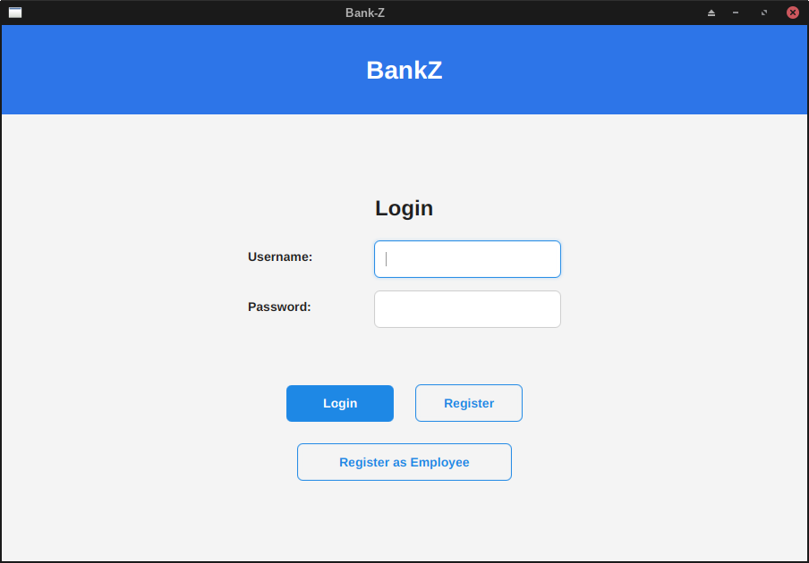
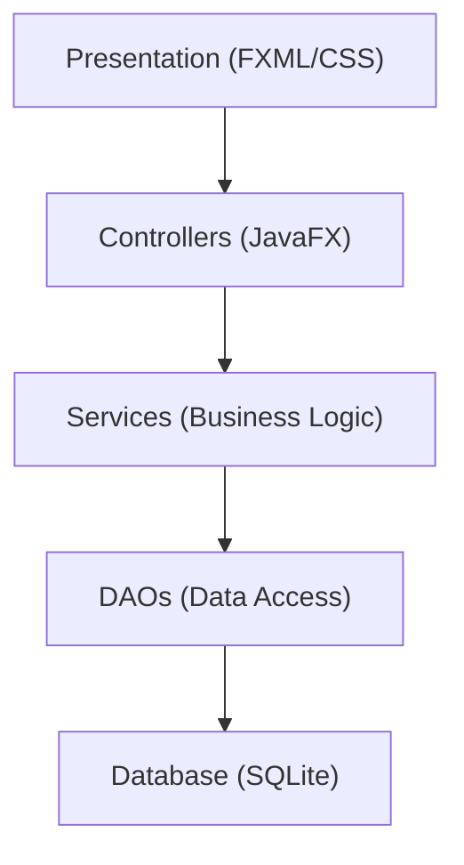

# Bank-Z

A modern, desktop-based bank management system designed for simplicity, security, and ease of use. Bank-Z provides essential banking functionalities for both customers and bank administrators with a clean, intuitive user interface.



## Table of Contents

- [Features](#features)
- [Technology Stack](#technology-stack)
- [Architecture](#architecture)
- [Prerequisites](#prerequisites)
- [Installation](#installation)
- [Building the Project](#building-the-project)
- [Running the Application](#running-the-application)
- [Project Structure](#project-structure)
- [Database Schema](#database-schema)
- [UI/UX Design](#uiux-design)
- [Testing](#testing)
- [Contributing](#contributing)
- [License](#license)

## Features

### Customer Features

- Secure user authentication
- Dashboard with account summaries and recent transactions
- Detailed view of individual accounts and transaction history
- Fund transfer between accounts
- Cash withdrawal and deposit simulation

### Admin/Employee Features

- Secure admin login
- Customer management (create, view, search, update)
- Account management (open, view, freeze, or close accounts)
- Comprehensive transaction viewer

## Technology Stack

- **Programming Language:** Java 24
- **UI Framework:** JavaFX
- **Database:** SQLite
- **Build & Dependency Management:** Apache Maven
- **UI Enhancements:** ControlsFX
- **Testing:** JUnit 5, Mockito

## Architecture

Bank-Z follows a layered architecture pattern with clear separation of concerns, combining elements of the Model-View-Controller (MVC) and Data Access Object (DAO) patterns.

### Architectural Layers

1. **Presentation Layer (View)**

   - Implemented using JavaFX FXML for UI layout
   - CSS for styling and theming
   - Controllers that handle user interactions

2. **Business Logic Layer (Service)**

   - Service classes that implement core business logic
   - Orchestrate operations between controllers and data access objects

3. **Data Access Layer (DAO)**

   - Data Access Objects that abstract database operations
   - Provide CRUD operations for each entity

4. **Data Model Layer (Model)**

   - Plain Old Java Objects (POJOs) representing domain entities

5. **Utility Layer**
   - Helper classes for common operations (database management, password hashing)

### Component Relationships



## Prerequisites

- Java 24 JDK
- Apache Maven 3.8+
- Git (for version control)

## Installation

1. Clone the repository:

   ```bash
   git clone https://github.com/jakariyaa/Bank-Z.git
   cd Bank-Z
   ```

2. Ensure you have Java 24 and Maven installed:
   ```bash
   java -version
   mvn -version
   ```

## Building the Project

To compile and build the project:

```bash
mvn clean compile
```

To create an executable JAR file:

```bash
mvn clean package
```

This will generate `bank-z.jar` in the `target` directory.

## Running the Application

### Using Maven

```bash
mvn javafx:run
```

### Using the Executable JAR

```bash
java -jar target/bank-z.jar
```

### Using Maven Exec Plugin

```bash
mvn exec:java
```

## Project Structure

```
Bank-Z/
├── pom.xml
├── bankz.db                 # SQLite database file
├── screenshots/             # Documentation images
├── src/
│   ├── main/
│   │   ├── java/com/bankz/
│   │   │   ├── App.java           // Main application entry point
│   │   │   ├── controllers/       // JavaFX controllers for each view
│   │   │   ├── dao/               // Data Access Objects for DB interaction
│   │   │   ├── models/            // Plain Old Java Objects (POJOs) for data
│   │   │   ├── services/          // Business logic
│   │   │   └── util/              // Utility classes (e.g., DB Connector)
│   │   └── resources/
│   │       └── com/bankz/
│   │           ├── fxml/          // FXML layout files
│   │           └── styles/        // CSS stylesheets
│   └── test/
│       └── java/com/bankz/
│           ├── dao/
│           └── services/
└── target/                      // Build output directory
```

## Database Schema

Bank-Z uses SQLite with the following tables:

### `customers` Table

| Column          | Type    | Constraints               | Description                           |
| --------------- | ------- | ------------------------- | ------------------------------------- |
| `customer_id`   | INTEGER | PRIMARY KEY AUTOINCREMENT | Unique identifier for the customer    |
| `first_name`    | TEXT    | NOT NULL                  | Customer's first name                 |
| `last_name`     | TEXT    | NOT NULL                  | Customer's last name                  |
| `username`      | TEXT    | NOT NULL UNIQUE           | Unique username for login             |
| `password_hash` | TEXT    | NOT NULL                  | Hashed password for security          |
| `date_created`  | TEXT    | NOT NULL                  | Date the customer profile was created |

### `employees` Table

| Column          | Type    | Constraints               | Description                        |
| --------------- | ------- | ------------------------- | ---------------------------------- |
| `employee_id`   | INTEGER | PRIMARY KEY AUTOINCREMENT | Unique identifier for the employee |
| `first_name`    | TEXT    | NOT NULL                  | Employee's first name              |
| `last_name`     | TEXT    | NOT NULL                  | Employee's last name               |
| `username`      | TEXT    | NOT NULL UNIQUE           | Unique username for admin login    |
| `password_hash` | TEXT    | NOT NULL                  | Hashed password for security       |
| `role`          | TEXT    | NOT NULL                  | e.g., 'Admin', 'Manager'           |
| `date_hired`    | TEXT    | NOT NULL                  | Date the employee was hired        |

### `accounts` Table

| Column           | Type    | Constraints                                                          | Description                        |
| ---------------- | ------- | -------------------------------------------------------------------- | ---------------------------------- |
| `account_id`     | INTEGER | PRIMARY KEY AUTOINCREMENT                                            | Unique identifier for the account  |
| `customer_id`    | INTEGER | NOT NULL, FOREIGN KEY(customer_id) REFERENCES customers(customer_id) | Links to the customer              |
| `account_number` | TEXT    | NOT NULL UNIQUE                                                      | Public account number              |
| `account_type`   | TEXT    | NOT NULL                                                             | e.g., 'Checking', 'Savings'        |
| `balance`        | REAL    | NOT NULL DEFAULT 0.0                                                 | Current account balance            |
| `date_opened`    | TEXT    | NOT NULL                                                             | Date the account was opened        |
| `status`         | TEXT    | NOT NULL DEFAULT 'ACTIVE'                                            | e.g., 'ACTIVE', 'FROZEN', 'CLOSED' |

### `transactions` Table

| Column                   | Type    | Constraints                                                         | Description                                    |
| ------------------------ | ------- | ------------------------------------------------------------------- | ---------------------------------------------- |
| `transaction_id`         | INTEGER | PRIMARY KEY AUTOINCREMENT                                           | Unique identifier for the transaction          |
| `source_account_id`      | INTEGER | FOREIGN KEY(source_account_id) REFERENCES accounts(account_id)      | The source account (NULL for deposits)         |
| `destination_account_id` | INTEGER | FOREIGN KEY(destination_account_id) REFERENCES accounts(account_id) | The destination account (NULL for withdrawals) |
| `type`                   | TEXT    | NOT NULL                                                            | 'DEPOSIT', 'WITHDRAWAL', 'TRANSFER'            |
| `amount`                 | REAL    | NOT NULL                                                            | Transaction amount (always positive)           |
| `timestamp`              | TEXT    | NOT NULL                                                            | Date and time of the transaction               |
| `description`            | TEXT    |                                                                     | Optional description                           |

## UI/UX Design

Bank-Z follows modern design principles with a clean and intuitive interface.

### Design Principles

- **Simplicity:** Clean layouts without clutter
- **Consistency:** Reusable styles and components
- **Accessibility:** Proper contrast ratios and keyboard navigation
- **Feedback:** Clear visual responses to user actions

### Color Palette

| Element         | Color Code | Usage                        |
| --------------- | ---------- | ---------------------------- |
| Primary Blue    | `#1E88E5`  | Headers, buttons, highlights |
| Secondary Gray  | `#F5F5F5`  | Backgrounds                  |
| Accent Green    | `#43A047`  | Success states               |
| Warning Orange  | `#FB8C00`  | Alerts, warnings             |
| Error Red       | `#E53935`  | Errors, failed actions       |
| Text Dark Gray  | `#212121`  | Primary text                 |
| Text Light Gray | `#757575`  | Secondary text               |

### Typography

- **Font Family:** Segoe UI / Roboto (fallback: Arial, sans-serif)
- **Font Sizes:**
  - Titles: 20–24px, bold
  - Section Headers: 16–18px, semi-bold
  - Body Text: 14–16px
  - Captions/Labels: 12–14px

## Testing

Bank-Z uses JUnit 5 for unit and integration testing with Mockito for mocking dependencies.

To run tests:

```bash
mvn test
```

### Testing Strategy

- **Unit Testing:** Individual methods in DAO and Service layers
- **Integration Testing:** Interaction between service layer and database
- **Manual UI Testing:** UI behavior and application flow verification

## Contributing

1. Fork the repository
2. Create a feature branch (`git checkout -b feature/AmazingFeature`)
3. Commit your changes (`git commit -m 'Add some AmazingFeature'`)
4. Push to the branch (`git push origin feature/AmazingFeature`)
5. Open a pull request

## License

This project is licensed under the MIT License - see the [LICENSE](LICENSE) file for details.

---

**Note:** This project is a work in progress and is not intended for production use.
